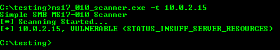

# ms17_010_scanner

This simple SMB vulnerability __MS17-010__ scanner is developed to help security professionals to quickly check if a computer is vulnerable
to __MS17-010__ vulnerability which is used by WannaCry and Petya malwares.

What this scanner will do:
* Connect to the target computer using port 445.
* Send __"SMB_COM_NEGOTIATE"__ and __"SMB_COM_SESSION_SETUP_ANDX"__ packets to establish an SMB session.
* Connect to the IPC$ share on the target computer by sending __"SMB_COM_TREE_CONNECT_ANDX"__ packet with TreeID set
to __\\<TARGET COMPUTER's IP>\IPC$__ and UserID set to the value returned by the server in the previous response.
* Check for __MS17-010__ vulnerability by sending an __"SMB_COM_TRANSACTION"__ packet, containing PeekNamedPipe subcommand set to FileID = 0.
* Check for the error response code __0xC0000205 (STATUS_INSUFF_SERVER_RESOURCES)__. If the code is found that means the target computer's Windows operating system is vulnerable to __MS17-010__.

## Downloads
ms17_010_scanner Windows executable file can be downloaded here
https://github.com/ch4meleon/ms17_010_scanner/releases/

## Usage
* Scan a target computer
```
python ms17_010_scanner.py -t 10.0.0.3
or
ms17_010_scanner.exe -t 10.0.0.3
```

* Scan a list of computers
```
python ms17_010_scanner.py -l hosts.txt
or
ms17_010_scanner.exe -l hosts.txt
```

## Screenshots


## Contact
ch4meleon@protonmail.com
